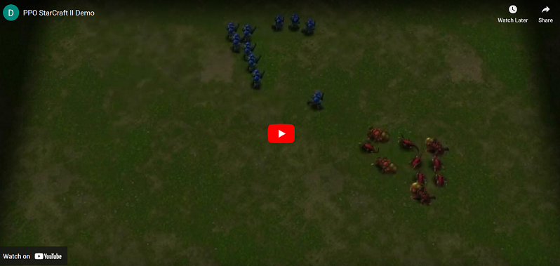
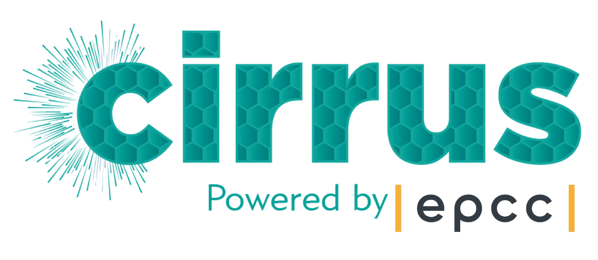

# PPO on StarCraft II LE
Implementation of the *Proximal Policy Optimization* Reinforcement Learning algorithm, uses DeepMind's StarCraft II Learning Environment for the variety of mini-games that it provides.

# Linux installation:
The installation requires agreement to the terms of [BLIZZARD STARCRAFT II AI AND MACHINE LEARNING LICENSE](http://blzdistsc2-a.akamaihd.net/AI_AND_MACHINE_LEARNING_LICENSE.html), by typing in the password '**iagreetotheeula**' during the installation process you agree to be bound by these terms.

<ins>**ARCHER2:**</ins>

* `make install_archer2`

<ins>**Cirrus:**</ins>

* `make install_cirrus`

Note that **pip** may throw a recommendation to update warning, however this should be <ins>ignored</ins> as the installation script downgrades pip to satisfy specific dependencies.

# Evaluating a model locally:
The repository provides the best trained model on *DefeatZerglingsAndBanelings* for evaluation, as the default setting. Note that the visualizations will not be rendered realtime and hence will be fast, this is due to a limitation of PySC2 which is unable to render realtime and remain deterministic. Hence with the realtime setting results are not reproducible, and is thus avoided.

1. `(Optional) Select model in configs/evaluate_config.py using the 'CHECK_LOAD' parameter (make sure it exists in checkpoints/) and adjust the environment with 'MINIGAME_NAME' if necessary.`
2. `make evaluate`

# Training on ARCHER2:

1. `(Optional) Modify 'config/train_archer2_config.py' to adjust hyperpameters, distributed training, policy model, pseudorandom seeds etc.`
2. `make train_archer2`
3. `Saved models will be periodically saved in 'checkpoints/'`

# Training on Cirrus:

1. `(Optional) Modify 'config/train_cirrus_config.py' to adjust hyperpameters, distributed/gpu training, policy model, pseudorandom seeds etc`
2. `make train_cirrus`
3. `Saved models will be periodically saved in 'checkpoints/'`

# Training locally (not recommended):
1. `(Optional) Modify 'config/train_local_config.py' to adjust hyperpameters, distributed/gpu training, policy model, pseudorandom seeds etc`
2. `(Optional) To configure number of parallel agents modify '--nproc_per_node=' in the Makefile under the **train_local** routine`
3. `make train_local`
4. `Saved models will be periodically saved in 'checkpoints/'`

# Running regression tests:
* `make regression_test`
  
# Directories overview:
- `Minutes/`
	* Formal write-ups of meetings, containing points of discussion, updates and actions to be completed.
- `evaluate.py`
	* Evaluates a model checkpoint.
- `train.py`
	* Entry point for the training procedure.
- `checkpoints/`
	* Saved models or models to be evaluated location.
- `scripts/`
-	* SLURM job scripts for ARCHER2 and Cirrus work launching.
- `data/`
	* Data from experiment/SLURM runs.
- `src/`
	* `Config.py`
		- Central file for project configuration, should allow to modify any desired settings.
	* `Misc.py`
		- Miscellaneous and helpers functions.
	* `Parallel.py`
		- Responsible for providing parallel functionality wrappers to the agent policy and hence to be trained on multi-core/gpu systems.
	* `rl/`
		- `Approximator.py`
			* Atari-net and FullyConv agent policy implementations.
		- `Loop`
			* Training and evaluation loop implementations, responsible for tying together all the RL components.
	* `starcraft/`
		- `Agent.py`
			* Responsible for updating the agent policy by piping feedback from the training environment in the form of scalar rewards.
		- `Environment.py`
			* Setup for the StarCraft II environments, configuring the mini-game type, rules and feature/action space.
- `test/`
	* `oracle/`
		- Snapshot of the project implementation.
	* `test_oracle.py`
		- Regression testing framework evaluator.
- `Makefile`
	* Configuration file for `make` containing various helper routines.

