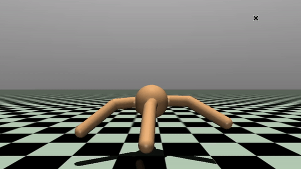

# T3D Serial Prototype
Implementation of the Twin Delayed DDPG Reinforcement Learning algorithm, uses OpenAI Gym for its environments.

The code provided can be run on Cirrus with the OpenAI Gym CarRacing-v2 environment, experiments on other environments and ARCHER2 are not currently supported.

  
   

## Installing dependencies:
1. Python 3.10+
2. Create a virtual environment via `venv`.
3. `make install`

## Running the prototype on Cirrus:
* `sbatch cirrus_job.slurm`
* Saved models will be periodically saved in 'checkpoints/'
* Periodic evaluation performance can be observed in 'perf.csv'

## Running regression test:
* `make test`

## Directory summary:
- `Minutes/`
    * Reactor simulation configuration file, structure has not changed from serial source. 
- `src/`
	* envi.py
		- Contains environment managers, wraps around OpenAI gym.
	* net.py
		- Neural network support code, used for defining the architecture of the networks.
	* replay.py
		- Replay buffer implementation used in off-policy algorithms.
	* train.py
		- Support code for the T3D algorithm training procedure.
	* misc.py
		- Performance trackers and distributions.

- `test/`
	* Contains the neural network verification regression testing framework.

- `evaluate.py`
    * Evaluates a checkpoint model, rendering can be toggled.

- `train.py`
	* Entry point and configuration file for the training procedure.
